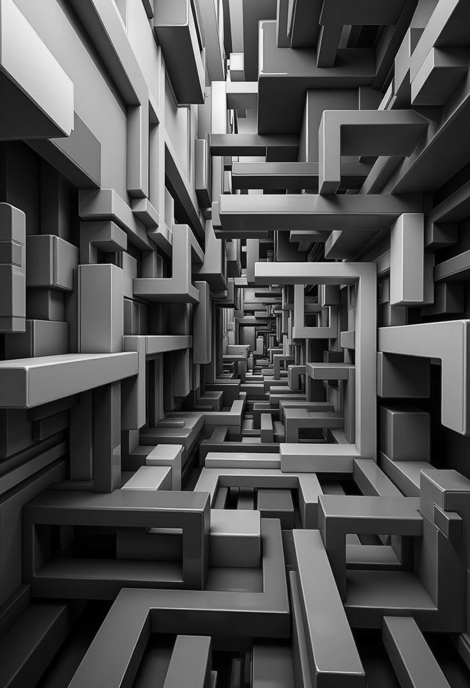
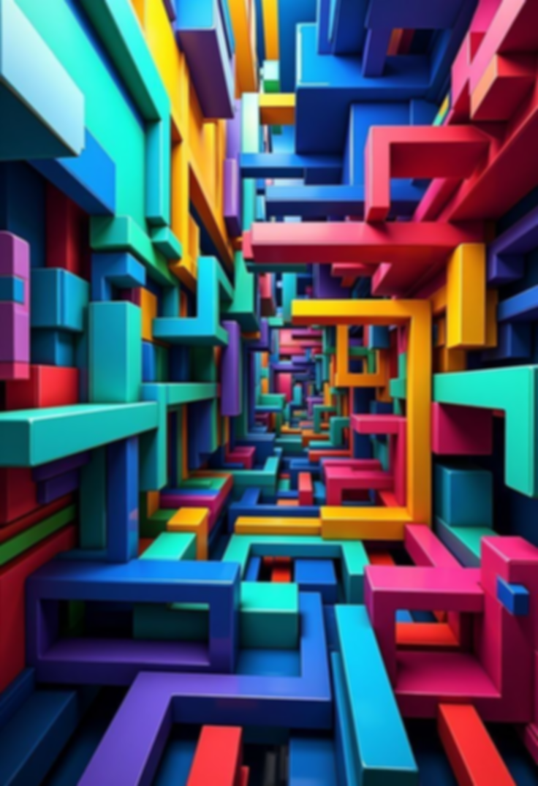
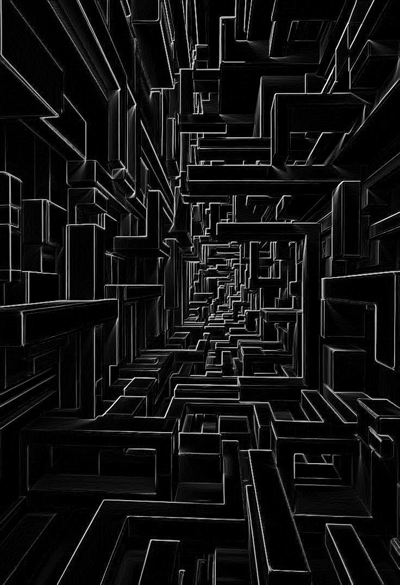
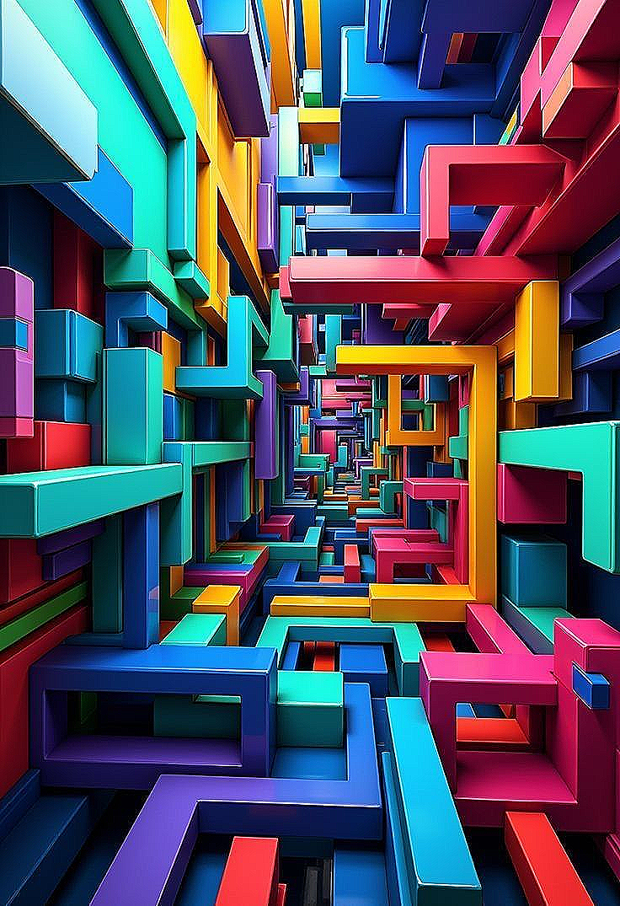
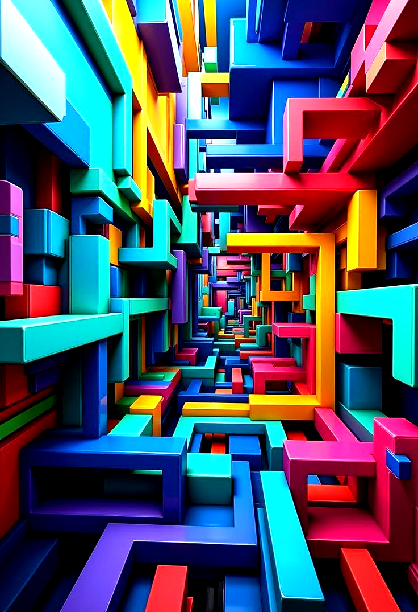
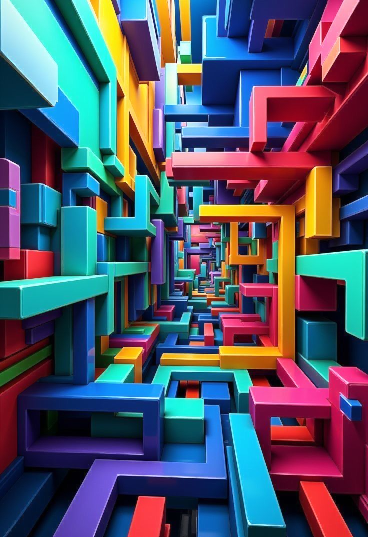
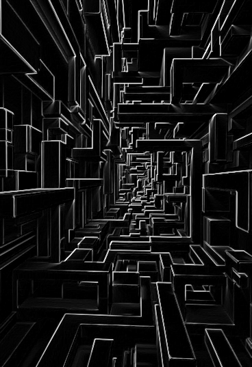
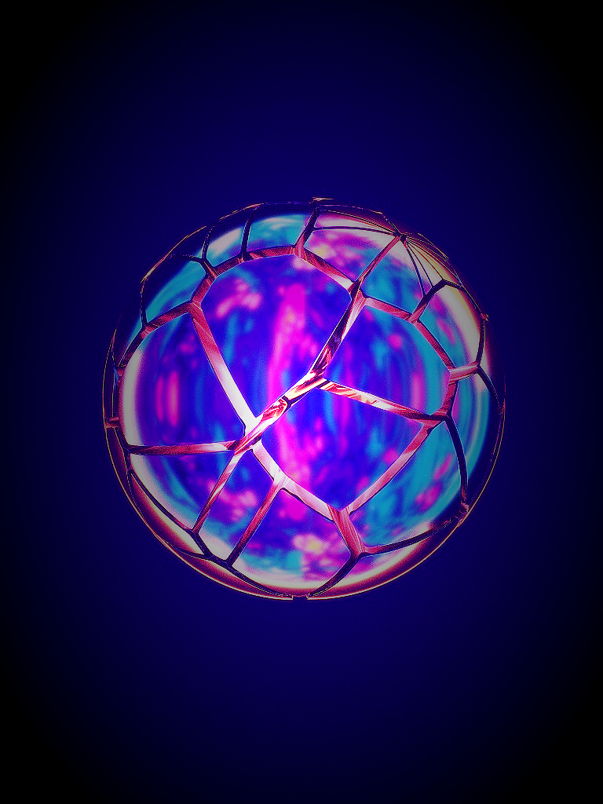
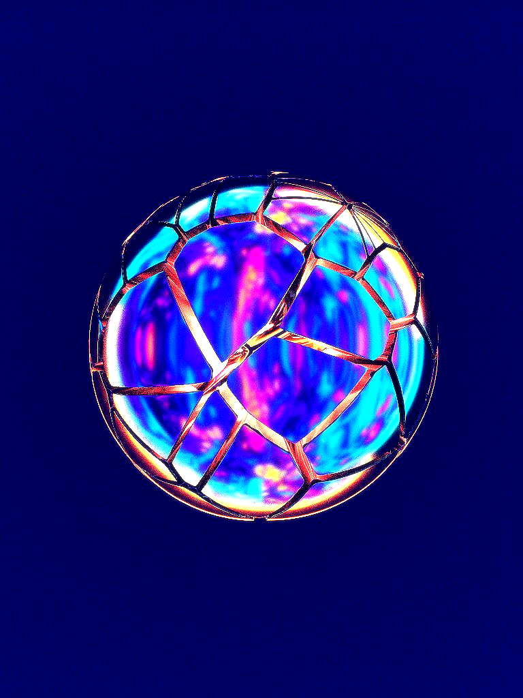

# lumina

a high-performance, vectorized image processing engine built from scratch in python. implements core computer vision operations like convolution and filtering with optimized numpy routines instead of high-level library calls.

## sample outputs

all outputs below were generated from a single input image using the lumina cli.

### original


---

### grayscale

```bash
lumina-cli test.jpg samples/grayscale.png --grayscale
```



---

### gaussian blur (3×3, σ=1.0)

```bash
lumina-cli test.jpg samples/blur.png --blur
```


---

### gaussian blur (7×7, σ=2.0)

```bash
lumina-cli test.jpg samples/blur_large.png --blur --blur-size 7 --sigma 2.0
```



---

### sobel edge detection

```bash
lumina-cli test.jpg samples/edges.png --edges
```



---

### sharpen

```bash
lumina-cli test.jpg samples/sharpen.png --sharpen
```



---

### brightness (factor 1.5)

```bash
lumina-cli test.jpg samples/bright.png --brightness 1.5
```


---

### contrast (factor 1.5)

```bash
lumina-cli test.jpg samples/contrast.png --contrast 1.5
```



---

### invert

```bash
lumina-cli test.jpg samples/invert.png --invert
```


---

### 2×2 max pooling

```bash
lumina-cli test.jpg samples/pooled.png --pool
```



---

### full pipeline (grayscale → blur → edges → pool)

```bash
lumina-cli test.jpg samples/full_pipeline.png --blur --edges --pool --verbose
```



---

### enchanting dreamwave filter
A soft, magical bloom effect with retro vaporwave color shifts and a vignette.



---

### enchanting hyperpop filter
A vibrant, high-contrast style that sharpens details and adds a subtle dreamy glow.



---

## what it does

- loads images from disk (`pillow`), stores pixel data as `numpy` arrays
- supports grayscale conversion (bt.601 luma weights)
- supports gaussian blur (configurable kernel size and sigma)
- supports sobel edge detection
- supports 2×2 max pooling
- supports brightness, contrast, sharpen, and invert filters
- chainable pipeline engine for composing operations
- dual backend: vectorized numpy (fast) and pure python (educational)
- saves output images back to disk

## install

```bash
python3 -m venv .venv
source .venv/bin/activate
pip install -e .
```

for development (includes pytest, mypy):

```bash
pip install -e ".[dev]"
```

## cli usage

```bash
lumina-cli <input_path> <output_path> [flags]
```

### available flags

| flag | description |
|---|---|
| `--grayscale` | convert to grayscale |
| `--blur` | apply gaussian blur |
| `--blur-size N` | kernel size for blur (must be odd, default: 3) |
| `--sigma F` | sigma for gaussian blur (default: 1.0) |
| `--edges` | apply sobel edge detection |
| `--pool` | apply 2×2 max pooling (shrinks image by 50%) |
| `--sharpen` | apply sharpening filter |
| `--brightness F` | adjust brightness by factor (e.g. 1.5 = brighter) |
| `--contrast F` | adjust contrast by factor (e.g. 1.3 = more contrast) |
| `--invert` | invert image colors |
| `--verbose` | show debug-level logging output |

### pipeline order

1. grayscale (auto-applied when `--edges` is used on rgb input)
2. brightness (optional)
3. contrast (optional)
4. blur (optional)
5. sharpen (optional)
6. edge detection (optional)
7. invert (optional)
8. max pooling (optional)

### examples

```bash
# basic edge detection
lumina-cli test.jpg output.png --edges

# full pipeline with verbose logging
lumina-cli test.jpg output.png --blur --edges --pool --verbose

# strong blur with custom kernel
lumina-cli test.jpg output.png --blur --blur-size 9 --sigma 3.0

# brightness + contrast combo
lumina-cli test.jpg output.png --brightness 1.3 --contrast 1.5
```

## pipeline engine

you can also use lumina programmatically with the pipeline engine:

```python
from lumina.io.loader import load_image
from lumina.io.saver import save_image
from lumina.ops.transform import to_grayscale
from lumina.filters.convolution import gaussian_blur
from lumina.filters.edges import sobel_filter
from lumina.pipeline.engine import Pipeline

image = load_image("test.jpg")

result = (
    Pipeline()
    .add(to_grayscale)
    .add(gaussian_blur, size=5, sigma=1.5)
    .add(sobel_filter)
    .run(image)
)

save_image(result, "output.png")
```

## backends

lumina has two backends that implement the same operations:

- **numpy** (default) — vectorized array operations, fast
- **python** — pure nested loops, slow but readable

```python
from lumina.backends import get_backend

fast = get_backend("numpy")
slow = get_backend("python")

result_fast = fast.to_grayscale(image)
result_slow = slow.to_grayscale(image)
# both produce the same output (within rounding tolerance)
```

## project structure

```text
src/lumina/
├── cli/main.py                # cli entry point
├── core/image.py              # image container class
├── io/
│   ├── loader.py              # image loading (pillow)
│   └── saver.py               # image saving
├── filters/
│   ├── convolution.py         # kernel convolution + gaussian blur
│   ├── edges.py               # sobel edge detection
│   └── basic.py               # brightness, contrast, sharpen, invert
├── ops/
│   ├── transform.py           # grayscale conversion
│   └── pooling.py             # 2×2 max pooling
├── pipeline/engine.py         # chainable pipeline
└── backends/
    ├── base.py                # abstract backend interface
    ├── numpy_backend.py       # vectorized backend
    └── python.py              # pure python backend

tests/                         # 90 tests across 10 files
benchmarks/                    # blur, edge, backend comparison
samples/                       # generated output images
```

## testing

```bash
# run all tests
pytest tests/ -v

# run with coverage
pytest tests/ -v --cov=lumina --cov-report=term-missing

# type checking
mypy src/lumina/ --ignore-missing-imports
```

**current status:** 90 tests passing, 76% coverage, 0 mypy errors.

## benchmarks

> all benchmarks run on apple silicon. results will vary by hardware.

### gaussian blur throughput

| image size | kernel | time | throughput |
|---|---|---|---|
| 256×256 | 3×3 | 2.77 ms | 23.7 Mpx/s |
| 256×256 | 5×5 | 5.09 ms | 12.9 Mpx/s |
| 256×256 | 7×7 | 7.65 ms | 8.6 Mpx/s |
| 512×512 | 3×3 | 12.10 ms | 21.7 Mpx/s |
| 512×512 | 5×5 | 20.34 ms | 12.9 Mpx/s |
| 512×512 | 7×7 | 30.71 ms | 8.5 Mpx/s |
| 1024×1024 | 3×3 | 50.93 ms | 20.6 Mpx/s |
| 1024×1024 | 5×5 | 79.58 ms | 13.2 Mpx/s |
| 1024×1024 | 7×7 | 120.86 ms | 8.7 Mpx/s |
| 2048×2048 | 3×3 | 210.13 ms | 20.0 Mpx/s |
| 2048×2048 | 5×5 | 331.01 ms | 12.7 Mpx/s |
| 2048×2048 | 7×7 | 484.68 ms | 8.7 Mpx/s |

throughput scales linearly with image size (good), and drops proportionally with kernel area (expected — a 7×7 kernel does 5.4x more work than 3×3).

### separable vs 2d kernel

gaussian kernels are mathematically separable — a single 2d convolution can be split into two 1d passes (horizontal + vertical). this reduces the work from O(k²) to O(2k) per pixel.

| image size | 2d kernel | separable | speedup |
|---|---|---|---|
| 256×256 | 8.17 ms | 1.73 ms | **4.74×** |
| 512×512 | 32.34 ms | 6.53 ms | **4.95×** |
| 1024×1024 | 123.55 ms | 27.63 ms | **4.47×** |

the separable approach gives a consistent ~4.5-5× speedup for 7×7 kernels. the theoretical max for a 7×7 kernel is 7²/(2×7) = 3.5×, but the separable version also benefits from better cache locality since each pass is 1d.

### sobel edge detection

| image size | time | throughput |
|---|---|---|
| 256×256 | 5.79 ms | 11.3 Mpx/s |
| 512×512 | 22.58 ms | 11.6 Mpx/s |
| 1024×1024 | 90.10 ms | 11.6 Mpx/s |
| 2048×2048 | 358.33 ms | 11.7 Mpx/s |

sobel runs at ~11.6 Mpx/s because it does two separate 3×3 convolutions (Kx and Ky) plus a magnitude computation. roughly half the throughput of a single blur, which makes sense.

### numpy vs python backend

this comparison shows why vectorization matters. the python backend does the exact same math but with explicit nested loops.

**grayscale conversion:**

| image size | numpy | python | speedup |
|---|---|---|---|
| 16×16 | 0.019 ms | 0.126 ms | 6.7× |
| 32×32 | 0.018 ms | 0.507 ms | 28.2× |
| 64×64 | 0.052 ms | 1.977 ms | 38.1× |
| 128×128 | 0.174 ms | 8.000 ms | **45.9×** |

**3×3 convolution:**

| image size | numpy | python | speedup |
|---|---|---|---|
| 16×16 | 0.146 ms | 0.728 ms | 5.0× |
| 32×32 | 0.115 ms | 7.089 ms | 61.6× |
| 64×64 | 0.669 ms | 34.306 ms | 51.3× |
| 128×128 | 0.979 ms | 49.098 ms | **50.2×** |

**2×2 max pooling:**

| image size | numpy | python | speedup |
|---|---|---|---|
| 16×16 | 0.021 ms | 0.047 ms | 2.3× |
| 32×32 | 0.012 ms | 0.152 ms | 12.3× |
| 64×64 | 0.025 ms | 0.602 ms | 24.5× |
| 128×128 | 0.077 ms | 2.400 ms | **31.3×** |

**color inversion:**

| image size | numpy | python | speedup |
|---|---|---|---|
| 16×16 | 0.013 ms | 0.164 ms | 12.5× |
| 32×32 | 0.003 ms | 0.641 ms | 236.6× |
| 64×64 | 0.008 ms | 2.781 ms | 355.1× |
| 128×128 | 0.007 ms | 10.761 ms | **1624.4×** |

the numpy advantage grows with image size because:
- numpy operations run in compiled c underneath, python loops pay interpreter overhead per pixel
- numpy benefits from simd vectorization and cache-friendly memory access
- for simple ops like inversion, numpy can process the entire array in one instruction while python loops over every pixel individually

### running benchmarks yourself

```bash
.venv/bin/python benchmarks/blur_benchmark.py
.venv/bin/python benchmarks/edge_benchmark.py
.venv/bin/python benchmarks/backend_comparison.py
```

---

## merits

- **truly from scratch** — all convolution, pooling, and filtering logic is handwritten using numpy primitives (no opencv, no scipy, no skimage)
- **fast for pure python** — 20+ Mpx/s for blur on a single core is competitive for a numpy-only implementation without c extensions
- **linear scaling** — throughput stays constant regardless of image size (no hidden O(n²) bottlenecks)
- **separable kernel optimization** — 4.5-5× speedup by decomposing 2d gaussians into two 1d passes
- **dual backend architecture** — strategy pattern lets users choose between performance (numpy) and readability (python)
- **composable pipeline** — chainable `.add().run()` api makes it easy to build custom processing graphs
- **well tested** — 90 tests, 76% coverage, 0 mypy errors, all pure unit tests with no file system dependencies
- **educational** — the python backend shows exactly what every algorithm does step-by-step in plain loops
- **clean cli** — single command to apply any combination of filters with configurable parameters

## demerits

- **single-threaded** — all operations run on one core. a real engine would parallelize across tiles or use thread pools
- **no gpu acceleration** — stuck on cpu. for production workloads, cuda/metal kernels would be 100-1000× faster
- **memory hungry** — `sliding_window_view` creates large intermediate views. a 4k image with a 7×7 kernel creates a 5d view that can eat several GB
- **no in-place operations** — every operation allocates a new array. chaining 5 filters on a 4k image creates 5 intermediate copies
- **limited filter set** — no resize, rotate, crop, affine transforms, histogram equalization, or morphological ops
- **uint8 precision loss** — clamping to uint8 after every operation causes cumulative rounding errors in long pipelines. a real engine would keep intermediate results in float32
- **no streaming / tiling** — can't process images larger than ram. production engines tile the image and process chunks
- **pillow dependency for i/o** — loading and saving still relies on pillow. a true from-scratch engine would decode png/jpeg manually
- **no color space support** — only works in rgb and grayscale. no hsv, lab, yuv conversions which are standard in cv pipelines
- **sobel is not optimized** — runs two full convolutions instead of using the separable property of sobel kernels
- **python backend is impractically slow** — useful for learning but 50-1600× slower than numpy. not viable for any real workload beyond tiny images

## tech stack

- python `>=3.9`
- `numpy` — vectorized array operations
- `pillow` — image file i/o
- `pytest` + `pytest-cov` — testing
- `mypy` — static type checking
